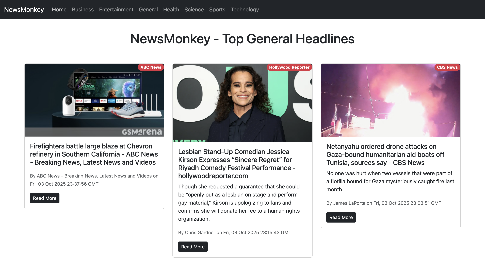

# 📰 NewsMonkey

**Get Your Daily Dose of News Free!**

NewsMonkey is a modern, responsive news application built with React that delivers the latest headlines from around the world. Stay informed with news across multiple categories including Business, Entertainment, Health, Science, Sports, and Technology.

## ✨ Features

- 🌍 **Real-time News**: Fetches latest headlines from News API
- 📱 **Responsive Design**: Works seamlessly on desktop, tablet, and mobile devices
- 🔄 **Infinite Scroll**: Smooth, endless scrolling experience for browsing articles
- 🎯 **Category Filtering**: Browse news by specific categories
- ⚡ **Fast Loading**: Optimized performance with React 18
- 🎨 **Modern UI**: Clean interface built with Bootstrap 5
- 📊 **Progress Indicator**: Visual loading bar for better UX

## 📸 Screenshots

### Home Page


### Category View


### Mobile Responsive


## 🛠️ Tech Stack

- **Frontend Framework**: React 18.2.0
- **Routing**: React Router DOM 6.9.0
- **Styling**: Bootstrap 5.3.0
- **UI Components**: 
  - React Infinite Scroll Component
  - React Top Loading Bar
- **API**: News API
- **Build Tool**: Create React App

## 📋 Prerequisites

Before you begin, ensure you have the following installed:
- Node.js (v14 or higher)
- npm or yarn
- A News API key (Get one free at [newsapi.org](https://newsapi.org))

## ⚙️ Installation

1. **Clone the repository**
   ```bash
   git clone https://github.com/akshit-phonsa/newsMonkey.git
   cd newsMonkey
   ```

2. **Install dependencies**
   ```bash
   npm install
   ```

3. **Set up environment variables**
   
   Create a `.env` file in the root directory:
   ```bash
   REACT_APP_NEWS_API=your_api_key_here
   ```
   
   Replace `your_api_key_here` with your actual News API key from [newsapi.org](https://newsapi.org)

4. **Start the development server**
   ```bash
   npm start
   ```
   
   The app will open at [http://localhost:3000](http://localhost:3000)

## 📦 Build for Production

Create an optimized production build:

```bash
npm run build
```

The build folder will contain the production-ready files.

## 🌐 Deployment

### Vercel Deployment

1. **Install Vercel CLI**
   ```bash
   npm i -g vercel
   ```

2. **Deploy**
   ```bash
   vercel
   ```

3. **Add Environment Variables**
   
   In your Vercel project dashboard:
   - Go to Settings → Environment Variables
   - Add `REACT_APP_NEWS_API` with your API key
   - Select all environments (Production, Preview, Development)
   - Redeploy the application

### Important Note for Production

The News API free tier has CORS restrictions that may prevent direct browser requests from deployed domains. For production use, consider:
- Creating a backend proxy server
- Upgrading to a News API paid plan
- Using an alternative news API

## 📁 Project Structure

```
newsMonkey/
├── public/
│   ├── index.html
│   └── favicon.ico
├── src/
│   ├── components/
│   │   ├── Navbar.js          # Navigation bar component
│   │   ├── News.js             # Main news feed component
│   │   ├── NewsItem.js         # Individual news card component
│   │   ├── Spinner.js          # Loading spinner component
│   │   └── loading.gif         # Loading animation
│   ├── App.js                  # Main app component with routing
│   ├── App.css                 # App styles
│   ├── index.js                # Entry point
│   └── index.css               # Global styles
├── .env                        # Environment variables (not in git)
├── .gitignore
├── package.json
└── README.md
```

## 🎯 Available Categories

- General
- Business
- Entertainment
- Health
- Science
- Sports
- Technology

## 🔧 Available Scripts

### `npm start`
Runs the app in development mode at [http://localhost:3000](http://localhost:3000)

### `npm test`
Launches the test runner in interactive watch mode

### `npm run build`
Builds the app for production to the `build` folder

### `npm run eject`
**Note: this is a one-way operation!** Ejects from Create React App for full configuration control

## 🐛 Known Issues & Solutions

### HTTP 426 Error on Deployment
The News API free tier has CORS restrictions. The app includes error handling to prevent crashes, but you may need a backend proxy for production.

### API Rate Limits
Free tier is limited to 100 requests per day. Consider implementing caching or upgrading your plan.

## 🤝 Contributing

Contributions are welcome! Please feel free to submit a Pull Request.

1. Fork the project
2. Create your feature branch (`git checkout -b feature/AmazingFeature`)
3. Commit your changes (`git commit -m 'Add some AmazingFeature'`)
4. Push to the branch (`git push origin feature/AmazingFeature`)
5. Open a Pull Request

## 📄 License

This project is open source and available under the [MIT License](LICENSE).

## 👤 Author

**Akshit Phonsa**

- GitHub: [@akshit-phonsa](https://github.com/akshit-phonsa)

## 🙏 Acknowledgments

- [News API](https://newsapi.org) for providing the news data
- [Create React App](https://create-react-app.dev/) for the boilerplate
- [Bootstrap](https://getbootstrap.com/) for the UI framework
- [React Router](https://reactrouter.com/) for routing

## 📞 Support

If you have any questions or run into issues, please open an issue on GitHub.

---

**Made with ❤️ using React**
